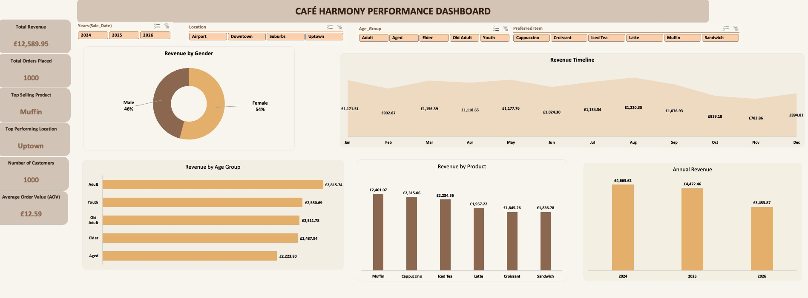

# Data Analytics Portfolio
# Project 1
**Title:** [Cafe Harmony Dashboard](https://github.com/gadesoji/gadesoji.github.io/blob/main/Cafe_Harmony.xlsx)

**Tools Used:** Microsoft Excel (Pivot Table, pivot chart, slicers)

**Project Description:**

Café Harmony is a café brand offering drinks, snacks, and light meals across multiple city locations. Over the past year, the business has experienced strong growth, resulting in increased customer demand, greater operational complexity, and a need for more consistent performance across its cafés. As the brand expands, management requires clearer visibility into customer behaviour, product performance, and operational efficiency to support informed decision-making.
This project was carried out with three (3) broad objectives namely;
1.	Analyse Café Harmony’s business data and develop a dashboard that supports managerial decision-making, 
2.	Identify key performance patterns, and
3.	Present actionable insights that can help leadership improve sales performance, customer targeting, stock management, and operational effectiveness.

**Key findings:**

Some of the insights gleaned from the analysis and recommended to management include but not limited to the following;
1.	As gender and age group influences purchasing behaviour, understanding the demographic profile of each location could help Café Harmony improve demand forecasting, optimise inventory planning, and deliver more targeted sales promotions,
2.	As a group, the café is not overly reliant on a single menu item, but subtle preferences for each location based on the gender and age distribution should inform stock inventory to prevent the likelihood of stock missed sales opportunities, and a weaker customer experience.

**Dashboard Overview:**

# Project 2
**Title:** Employee records: data interrogation

**SQL Code:** [SQL codes: DML](https://github.com/gadesoji/gadesoji.github.io/blob/main/NextGen.sql)

**SQL Skills Used:** 
* Data Retrieval (SELECT): Queried and extracted specific information from the database.
* Data Aggregation (SUM, COUNT): Calculated totals, such as sales and quantities, and counted records to analyze data trends.
* Data Filtering (WHERE, BETWEEN, IN, AND): Applied filters to select relevant data, including filtering by ranges and lists.
* Data Source Specification (FROM): Specified the tables used as data sources for retrieval

**Project Description:**

**Technology used:** SQL server
