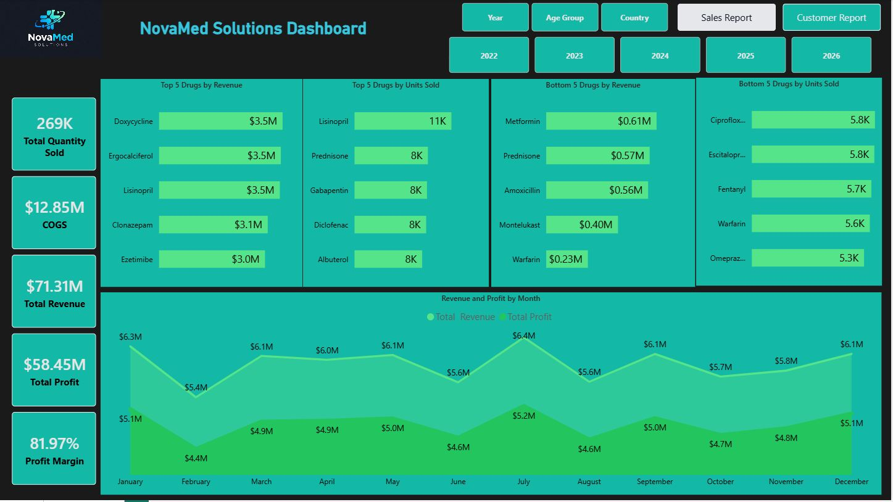
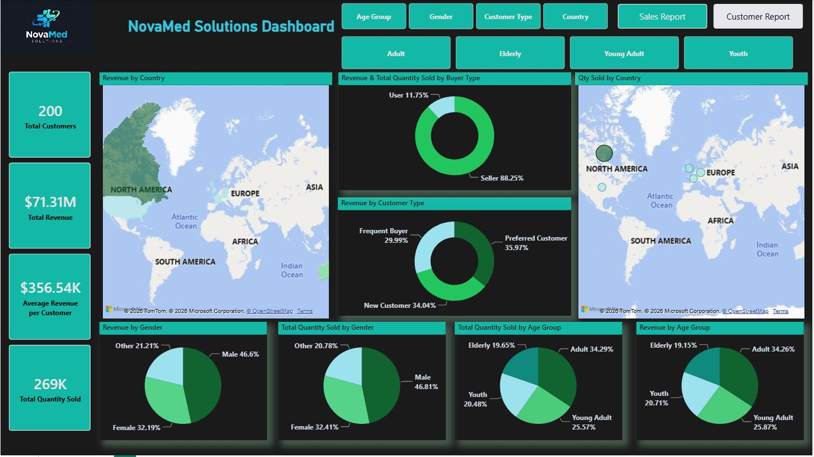

# Data Analytics Portfolio
# Project 1
**Title:** [Cafe Harmony Dashboard](https://github.com/gadesoji/gadesoji.github.io/blob/main/Cafe_Harmony.xlsx)

**Tools Used:** Microsoft Excel (Pivot Table, pivot chart, slicers)

**Project Description:**

Café Harmony is a café brand offering drinks, snacks, and light meals across multiple city locations. Over the past year, the business has experienced strong growth, resulting in increased customer demand, greater operational complexity, and a need for more consistent performance across its cafés. As the brand expands, management requires clearer visibility into customer behaviour, product performance, and operational efficiency to support informed decision-making.
This project was carried out with three (3) broad objectives namely;
1.	Analyse Café Harmony’s business data and develop a dashboard that supports managerial decision-making, 
2.	Identify key performance patterns, and
3.	Present actionable insights that can help leadership improve sales performance, customer targeting, stock management, and operational effectiveness.

**Key findings:**

Some of the insights gleaned from the analysis and recommended to management include but not limited to the following;
1.	As gender and age group influences purchasing behaviour, understanding the demographic profile of each location could help Café Harmony improve demand forecasting, optimise inventory planning, and deliver more targeted sales promotions,
2.	As a group, the café is not overly reliant on a single menu item, but subtle preferences for each location based on the gender and age distribution should inform stock inventory to prevent the likelihood of stock missed sales opportunities, and a weaker customer experience.

**Dashboard Overview:**

# Project 2
**Title:** [NovaMed Solutions Market Analysis](https://github.com/gadesoji/gadesoji.github.io/blob/main/NovaMed%20Solutions%20Report.pbix)

**Tools Used:** Power BI, DAX, Excel Power Query

**Project Description:**

NovaMed Solutions, a leading pharmaceutical distributor, faces challenges in improving sales, managing inventory, and identifying market opportunities.
Over the past year, NovaMed Solutions has collected sales data on revenue, profit margins, drug performance, and customer demographics, creating an opportunity for analysis, trend detection, and data-driven improvements.
To improve sales monitoring and enhance customer insights, along side this report, I developed an interactive Power BI dashboard centred on two primary areas:
1.	Top/Bottom Analysis – This module will monitor overall sales metrics, including revenue, profit, and cost of goods sold (COGS), with month-over-month comparisons. It will also identify the best- and worst-performing drugs and customers using dynamic metrics.
2.	Customer Analysis – This section will deliver insights into customer demographics, revenue distribution by buyer type, and purchasing behaviour. It will also feature geographical sales data, highlighting key revenue-generating regions.
These dashboards will provide stakeholders with a comprehensive understanding of sales trends and customer engagement, facilitating informed, data-driven decision-making.

**Key findings/recommendations:**

Some of the insights gleaned from the analysis and recommendations made include the following;
*	Investigate February and August revenue dips and actions to improve performance.
*	Assess why the best-selling drug outperforms others and develop strategies to grow high-potential products.
*	Prioritise key revenue drivers, as unit sales and revenue rankings differ significantly across products.
*	Review the supply chain for savings through new suppliers, better terms, or bulk discounts.
*	Improve production efficiency to reduce costs.
*	Grow market share in other countries, as two countries generate nearly three-quarters of revenue.

**Dashboard Overview:**

# Project 3
**Title:** Employee Success Analytics at NextGen Corp: Data Interrogation

**SQL Code:** [SQL codes: DML](https://github.com/gadesoji/gadesoji.github.io/blob/main/NextGen.sql)

**SQL Skills Used:** 
* Data Retrieval (SELECT): Queried and extracted specific information from the database.
* Data Aggregation (SUM, COUNT): Calculated totals, such as sales and quantities, and counted records to analyze data trends.
* Data Filtering (WHERE, BETWEEN, IN, AND): Applied filters to select relevant data, including filtering by ranges and lists.
* Data Source Specification (FROM): Specified the tables used as data sources for retrieval

**Project Description:**

NextGen Corp. is growing quickly in competitive software and hardware markets. Although the company continues to attract top talent, it faces increasing concerns about employee turnover, uneven departmental performance, and possible pay disparities.
To support this growth, I was assigned to lead a comprehensive, data-driven initiative focused on improving retention strategies, standardising performance measurement, and creating a fair compensation structure.

**Technology used:** SQL server
